面向航空航天在轨计算

的光学 CNN 加速系统

—— Optic-SpaceNet

多模型架构量化迁移 × 曦智 Gazelle 光计算平台

曦智科技 命题

**CICC 1003564**

## **快速预览 (1/2)**

### **核心技术与创新**

**光计算精度有限、噪声大**：基于 STE、LSQ+ 等方案进行量化感知微调，在训练时模拟注入光计算噪音，增强模型鲁棒性

**光计算对输入 Shape 有要求**：算法-硬件联合设计，基于 8x2 Tiling 选取模型超参数，消除补零浪费

**首层精度敏感、Padding 损耗大**：首层执行 FP32 电运算，规避 62.5% 空算开销，同时消除零填充对 BN 统计值的影响

**端到端闭环工具链**：自主研发涵盖“数据-训练-量化-转化-部署”全流程自动闭环（47个Python文件），代码健壮性极高且全程可追溯

### **作品概况**

**作品名称：** Optic-SpaceNet · 光学CNN在轨加速系统

**应用场景：** 卫星在轨遥感图像计算

（数据集: EuroSAT 10类地物分类）

**核心痛点解决：充分利用光计算优势**

- 极低功耗
- 天然免疫单粒子翻转(SEU)
- 长寿命

Optic-SpaceNet · 光学 CNN 在轨加速系统

02 / 17

## **快速预览 (2/2)**

### **重要性能指标**

- **模型轻量化**：模型参数仅 268K；单图计算负荷 10-3 GOPS，单图理论推理速度 **0.4s**。
- **光计算占比**达**90.65%** ，最大化释放光计算高能效优势。
- Sim-to-Real 误差小：依托物理噪声QAT训练，训练指标与实际仿真误差缩减至仅 **\~1.6%**（传统方法约为5-10%）。
- **优异的分类准确率**：经历7阶段量化演进后，包含完整硬件噪声的 Gazelle 仿真结果(全量5400张测试集)依然保持 **90.43%** 和**90.28%** 的高准确率。

Optic-SpaceNet · 光学 CNN 在轨加速系统

03 / 17

## **在轨遥感计算的结构性困境**

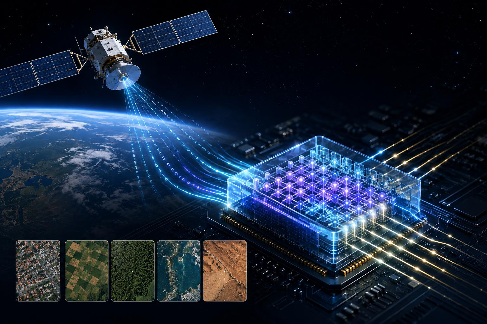

<table>
  <tr>
    <th>评价指标</th>
    <th>电子计算 (GPU/ASIC)</th>
    <th>光学计算核 (Gazelle)</th>
  </tr>
  <tr>
    <td>功耗与散热</td>
    <td>极高 (散热设计庞大)</td>
    <td>极低 (超高能量效率)</td>
  </tr>
  <tr>
    <td>单粒子翻转 (SEU)</td>
    <td>高发 (需复杂冗余纠错)</td>
    <td>天然免疫 (模拟物理过程)</td>
  </tr>
  <tr>
    <td>计算延迟</td>
    <td>受寄存器、总线带宽限制</td>
    <td>光速波分/并行相干运算</td>
  </tr>
  <tr>
    <td>太空退化寿命</td>
    <td>电学老化、寿命5-10年</td>
    <td>无电偏置老化、寿命&gt;10年</td>
  </tr>
</table>

\*光计算核心芯片抗 SEU 辐射能力强，但外围的 DAC/ADC、FPGA 等电气模块仍需辅以常规宇航加固措施。

Optic-SpaceNet · 光学 CNN 在轨加速系统

04 / 17

## **遥感数据集与十类地物分类任务**

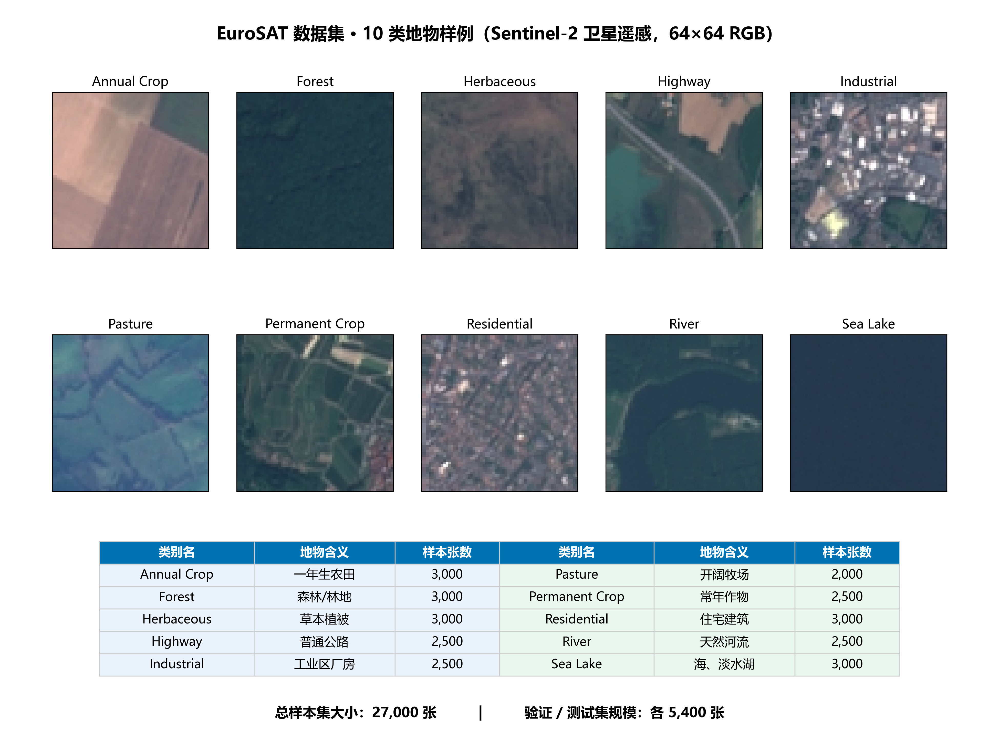

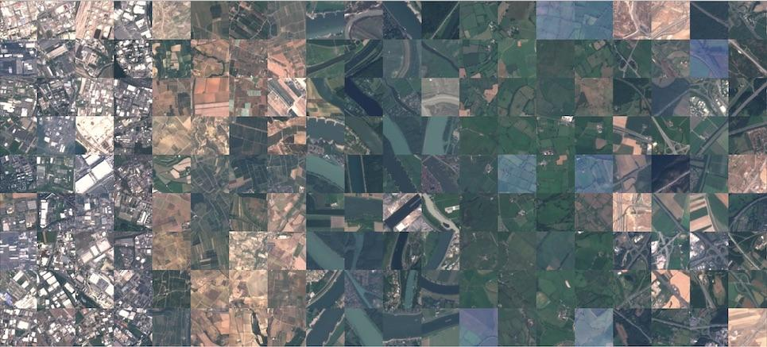

数据集：[https://www.modelscope.cn/datasets/lhh010/EuroSAT\_RGB](https://www.modelscope.cn/datasets/lhh010/EuroSAT_RGB)

Optic-SpaceNet · 光学 CNN 在轨加速系统

05 / 17

## **硬件模拟平台 Gazelle 环境**

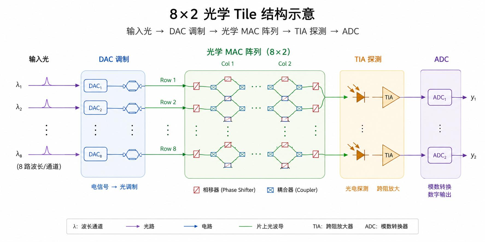

- 分块约束：tile 8×2，输入长度须被8整除
- 物理线性度 99.4%，偏差可忽略
- 精度损失源于量化噪声及激活量化精度
- 模型需要减少计算量，并避免误差积累

<table>
  <tr>
    <th>物理属性</th>
    <th>数值</th>
    <th>物理约束 / 工程学影响</th>
  </tr>
  <tr>
    <td>物理计算 Tile</td>
    <td>8×2 (k=8, n=2)</td>
    <td>卷积乘加展平后长度必须被 8 整除，否则硬件必须补零闲置</td>
  </tr>
  <tr>
    <td>原生支持精度</td>
    <td>8-bit 激活 / 
8-bit 权重</td>
    <td>支持 INT8 GEMM</td>
  </tr>
  <tr>
    <td>运算速率</td>
    <td>2.6MOPs</td>
    <td>算力总容量极其有限，要求工程上必须采用极度轻量化的网络结构以避免大量计算</td>
  </tr>
  <tr>
    <td>存在物理噪声</td>
    <td>-</td>
    <td>深网络可能会导致准确率明显下降</td>
  </tr>
</table>

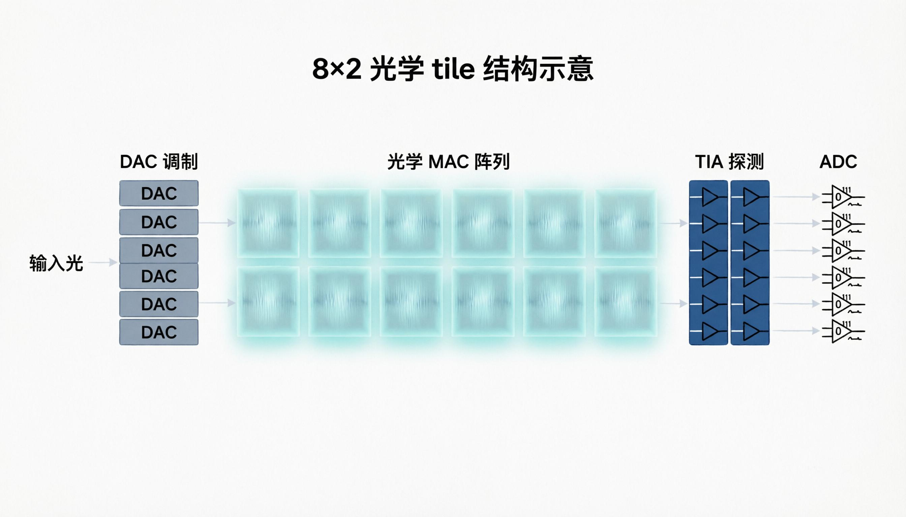

Optic-SpaceNet · 光学 CNN 在轨加速系统

06 / 17

## **模型设计：硬件感知架构**

<table>
  <tr>
    <th>评估对比维度</th>
    <th>Model 1 (基准 VGG)</th>
    <th>Model 2 (SpaceNet V1)</th>
    <th>Model 3 (SpaceNet V2)</th>
  </tr>
  <tr>
    <td>架构定义</td>
    <td>6×Conv (3×3) + 2×FC</td>
    <td>4×Conv (1×1 / 2×2) + 2×FC</td>
    <td>同 Model 2 (引入知识蒸馏)</td>
  </tr>
  <tr>
    <td>模型参数量</td>
    <td>2.39 M</td>
    <td>268 K (降低至 1/9)</td>
    <td>268 K (降低至 1/9)</td>
  </tr>
  <tr>
    <td>首层对齐/硬件处理</td>
    <td>27 (对齐率 84.4%) / 光学计算</td>
    <td>3 (对齐率 37.5%) / 留电计算</td>
    <td>3 (对齐率 37.5%) / 留电计算</td>
  </tr>
  <tr>
    <td>综合对齐对位率</td>
    <td>99.8%</td>
    <td>99.6%</td>
    <td>99.6%</td>
  </tr>
  <tr>
    <td>单图有效计算复杂度</td>
    <td>156.6M MOPs</td>
    <td>1.05M MOPs (轻量)</td>
    <td>1.05M MOPs (轻量)</td>
  </tr>
  <tr>
    <td>QAT 与训练策略</td>
    <td>监督分类训练 (FP32)</td>
    <td>硬件适配定标从零 QAT</td>
    <td>ResNet-18 蒸馏辅导训练
 (教师: 97.83%)
$L_{KD}=\left(1-\alpha \right)L_{CE}+\alpha T^2L_{KL}$
T = 4.0,$    \alpha $= 0.7</td>
  </tr>
</table>

用 1/9 的参数量 实现 1/150 的在轨推算负担。

Optic-SpaceNet · 光学 CNN 在轨加速系统

07 / 17

## **七阶段量化演进**

褐色为model1 变体A     深绿色为model1 变体B   q650表示测试集跑了650张

<table>
  <tr>
    <th>阶段</th>
    <th>内容</th>
    <th>核心技术要素</th>
    <th>M1 (VGG)</th>
    <th>M2 (SN V1)</th>
    <th>M3 (SN V2+KD)</th>
  </tr>
  <tr>
    <td>① FP32 基准</td>
    <td>标准全精度训练</td>
    <td>标准CNN训练, 无量化，M1 bias=True; M2/M3 Conv bias=False</td>
    <td>97.17%</td>
    <td>90.15%</td>
    <td>91.44%</td>
  </tr>
  <tr>
    <td>② QAT 微调</td>
    <td>FP32→int4，
STE 微调</td>
    <td>BN融合→QAT层替换→低lr微调15-20 epoch</td>
    <td>85.91%</td>
    <td>73.63%</td>
    <td>73.22%</td>
  </tr>
  <tr>
    <td>③ QAT 预训练</td>
    <td>从头学习 int4 特征</td>
    <td>随机初始化, epoch-1起全int4伪量化, STE</td>
    <td>91.17%</td>
    <td>81.20%</td>
    <td>83.26%</td>
  </tr>
  <tr>
    <td>④ 非对称量化       +噪声</td>
    <td>非对称量化 + 噪声正则化</td>
    <td>uint8激活/int4权重, Gaussian噪声, bias=False, BN保留 （M2/M3 为 bug 修复后重跑值）</td>
    <td>96.46%</td>
    <td>91.06% *</td>
    <td>91.50% *</td>
  </tr>
  <tr>
    <td>⑤ 混合精度</td>
    <td>探索多种精度混合方案</td>
    <td>测试首层 FP32、Linear FP32 等不同策略</td>
    <td>98.26%</td>
    <td>91.26%</td>
    <td>91.13%</td>
  </tr>
  <tr>
    <td>⑥ Gazelle QAT</td>
    <td>int8 原生精度 + 硬件噪声</td>
    <td>改用 int8权重, 尝试模拟插入多种 DAC 噪声, stem FP32</td>
    <td>97.87%
98.02%</td>
    <td>92.06%</td>
    <td>91.83%</td>
  </tr>
  <tr>
    <td>⑦ osimulator真机实测</td>
    <td>真实光计算硬件仿真</td>
    <td>COMPASS 8a8w12o</td>
    <td>98.15% (q650) 
97.54% (q650)</td>
    <td>90.43%
（全量5400)</td>
    <td>90.28%（全量5400)</td>
  </tr>
</table>

Optic-SpaceNet · 光学 CNN 在轨加速系统

\* 为bug修复后的重跑结果

08 / 17

## **七阶段精度曲线**

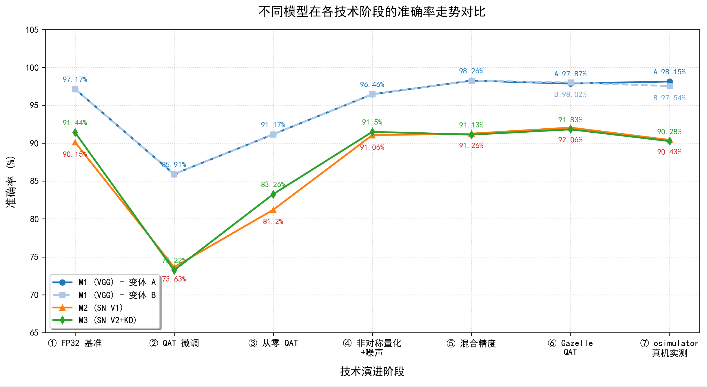

INT4 STE 限制模型学习能力、

首末层信息损失

FP32 权重依赖精细精度，突变量化破坏特征，低 lr 逃不出坏的局部最优

QAT Conv 相关 Bug

09 / 17

## **核心创新：**

<table>
  <tr>
    <th>核心技术</th>
    <th>关键做法</th>
    <th>核心成果</th>
  </tr>
  <tr>
    <td>① 训练引入物理噪声</td>
    <td>在 QAT 训练中模拟硬件噪声，让模型提前适应光计算高噪环境</td>
    <td>实际仿真结果接近训练指标，光计算迁移损失仅 ~1.6%</td>
  </tr>
  <tr>
    <td>② QAT 量化感知训练</td>
    <td>INT8 QAT 预训练，模型全程感知硬件量化精度</td>
    <td>学出最佳量化分阶（LSQ+），消除系统级截断误差</td>
  </tr>
  <tr>
    <td>③ 首层异构计算</td>
    <td>首层 3 通道卷积（宽度未对齐 8×2）强制执行 FP32/FPGA 电算</td>
    <td>避免 62.5% 空算开销；避免零填充噪声对 BN 统计值的影响</td>
  </tr>
  <tr>
    <td>④ 硬件感知结构</td>
    <td>内部通道取 8 的倍数，使内部卷积层逐层对齐 8×2 tile</td>
    <td>综合对齐率 99.6%，光计算层零补零浪费 → 有效算力 = 名义算力 *</td>
  </tr>
</table>

\*仅 RGB 首层例外，已置电计算，见③

Optic-SpaceNet · 光学 CNN 在轨加速系统

10 / 17

## **量化感知训练（QAT）**

STE 直通估计器

LSQ+ 可学习步长

硬件噪声匹配训练

将物理噪声注入训练，降低光计算迁移损失

Gazelle 物理噪声注入前向链。

**前向噪声链**

**部署差距**

**前向动态 Scale 计算**

$s=\frac{abs\_max\left(x\right)}{q_{max}}$

**反向恒等直通 (STE)**

$\frac{\partial L}{\partial x}\approx \frac{\partial L}{\partial x_{dq}}$

**PyTorch 梯度截断实现**

\# 前向走量化，反向走连续梯度流

x\_dq = x + (x\_dq - x).detach()

将量化尺度（ $s$ ）与非对称零点（ $zp$ ）设为可学习参数，结合梯度信息自适应优化动态截断范围。

**可学习步长量化前向**

$x_{dq}=\left[round\left(\frac{x}{s}+zp\right)\right]\cdot s$

**梯度尺度缩放 (G-Scale)**

$g_{scale}\propto \frac{1}{\sqrt{N\cdot n_{levels}}}$

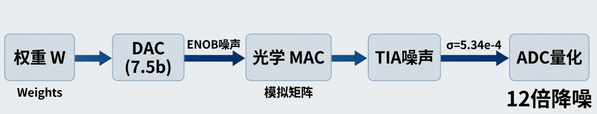

### **\~1.6%**

真机部署精度 Gap

### **5\~10%**

传统强扰动 Gap

STE 简单稳定、scale 不可学

LSQ+ 上限更高、能学最优量化范围

激活用 STE 动态 scale

权重用 LSQ+

Optic-SpaceNet · 光学 CNN 在轨加速系统

11 / 17

## **自动闭环工具链：全流程端到端打通**

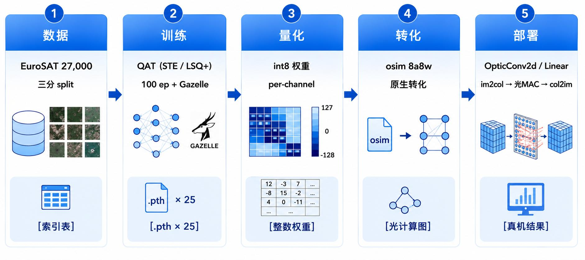

**工程代码量证明：** 系统化闭环。本项目自主设计了 47 个 python 文件（包括 core/qat/data/training/scripts 等分层结构），并稳定通过 11 个核心 QAT bug 的跟踪及修复，健壮性极高。

Optic-SpaceNet · 光学 CNN 在轨加速系统

12 / 17

Model 2/3 (遥感特征图 64×64) 逐层物理相干计算量分布

## **光计算占比：突破 90%**

<table>
  <tr>
    <th>网络层</th>
    <th>物理属性</th>
    <th>展平长度</th>
    <th>硬件对齐率</th>
    <th>算力负荷 (MOPs)</th>
    <th>运行器件空间</th>
  </tr>
  <tr>
    <td>stem</td>
    <td>Conv 3→8, 1×1</td>
    <td>3</td>
    <td>37.5%</td>
    <td>0.098 MOPs</td>
    <td>电计算 (FP32)</td>
  </tr>
  <tr>
    <td>stage1</td>
    <td>Conv 8→16, 2×2</td>
    <td>32</td>
    <td>100.0%</td>
    <td>0.524 MOPs</td>
    <td>光子核心 (int8)</td>
  </tr>
  <tr>
    <td>stage2</td>
    <td>Conv 16→32, 2×2</td>
    <td>64</td>
    <td>100.0%</td>
    <td>0.131 MOPs</td>
    <td>光子核心 (int8)</td>
  </tr>
  <tr>
    <td>stage3</td>
    <td>Conv 32→16, 1×1</td>
    <td>32</td>
    <td>100.0%</td>
    <td>0.033 MOPs</td>
    <td>光子核心 (int8)</td>
  </tr>
  <tr>
    <td>fc1</td>
    <td>Linear 1024→256</td>
    <td>1024</td>
    <td>100.0%</td>
    <td>0.262 MOPs</td>
    <td>光子核心 (int8)</td>
  </tr>
  <tr>
    <td>fc2</td>
    <td>Linear 256→10</td>
    <td>256</td>
    <td>100.0%</td>
    <td>0.003 MOPs</td>
    <td>光子核心 (int8)</td>
  </tr>
  <tr>
    <td>整机
合并</td>
    <td>-</td>
    <td>-</td>
    <td>99.6%</td>
    <td>1.051 MOPs</td>
    <td>光: 0.953M  电: 0.098M</td>
  </tr>
</table>

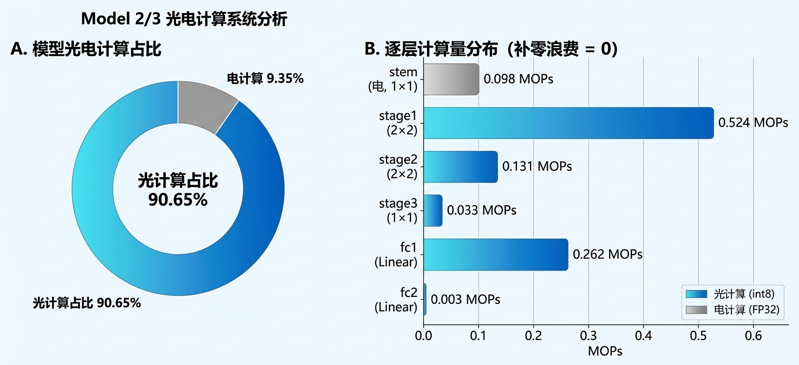

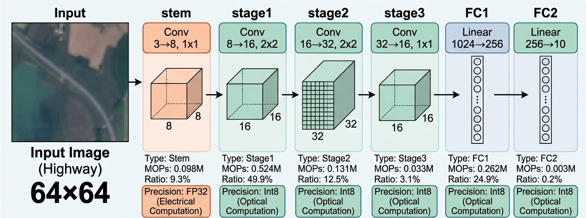

光子MOPs 占比**90.65%**

13 / 17

**验证闭环**

**验证机制**（双级闭环） 秒级QAT仿真 ⇄ 数小时模拟器实测

**抗噪精度** 预注入标定噪声，实际光计算较QAT回撤极小（M2 ↓1.63%，M3 ↓1.55%） **消融对比** 蒸馏M3（90.28%） vs 无蒸馏M2（90.43%） → 无统计显著性差异

**根本归因** 鲁棒性源于训练中适应物理噪声，而非高维教师网络拟合

**可视化前端**

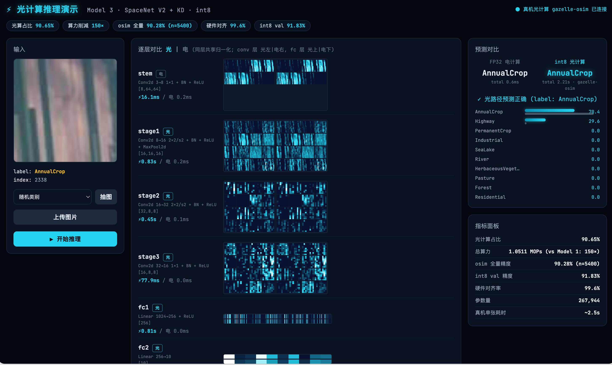

Optic-SpaceNet · 光学 CNN 在轨加速系统

14 / 17

**计算效率与在轨部署决策分析**

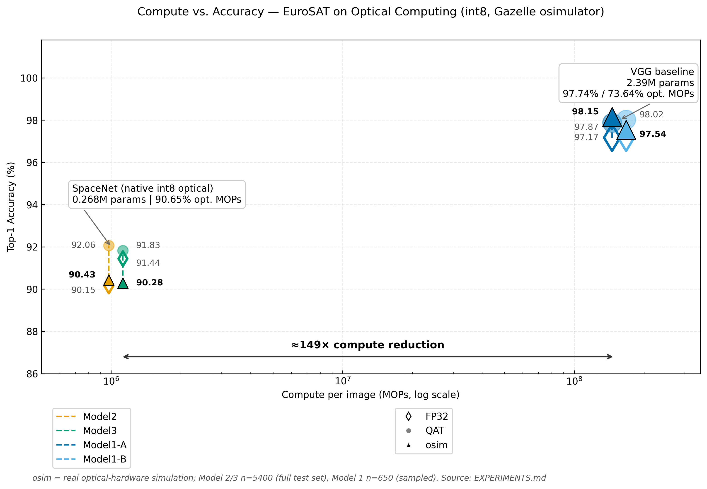

**轻量化降维打击：破除卫星上电能瓶颈**

Model 2/3 推理开销

**1.05 MOPs≈10-3 GOPS**

参数量仅 **268K**，高度适应低负荷在轨载荷

按 2.6 MOPs 计算的理论上板运行速度

**理论上推理一张图片0.4s**

全量模拟耗时

**\~3.7 小时**

累积调用物理芯片引擎 27,000 次

（5 光计算层 × 5400 张）

Model 1 (VGG Baseline) 无在轨实际可行性：

单张图像耗算高达 156.6M MOPs (上板约 60s)。仿真推理单张高达 150 秒，跑完测试集累计需要 9 天！其功耗与时延远超在轨资源上限，根本无法搭载上天。

Optic-SpaceNet · 光学 CNN 在轨加速系统

15 / 17

## **系统成果总结与未来在轨展望**

<table>
  <tr>
    <th>指标</th>
    <th>Model 1</th>
    <th>Model 2</th>
    <th>Model 3</th>
  </tr>
  <tr>
    <td>光计算
占比</td>
    <td>97.74%
73.64%</td>
    <td>90.65%</td>
    <td>90.65%</td>
  </tr>
  <tr>
    <td>光计算精度</td>
    <td>98.15%
（q650）
97.54%
（q650）</td>
    <td>90.43%
（全量5400）</td>
    <td>90.28%
（全量5400）</td>
  </tr>
  <tr>
    <td>参数量</td>
    <td>2.39M</td>
    <td>268K</td>
    <td>268K</td>
  </tr>
  <tr>
    <td>总 MOPs/张</td>
    <td>156.6M</td>
    <td>1.05M</td>
    <td>1.05M</td>
  </tr>
</table>

未来在轨展望中，我们将以多阶段混合分割策略为核心，动态权衡光电计算配比；结合硬件在环闭环训练持续降低物理偏差；最终实现星载光学遥感数据的端到端实时语义分割，打通从地面训练到太空推理的全链路闭环，为高时效、低功耗的星上智能感知提供可靠支撑。

褐色为model1 变体A     深绿色为model1 变体B   q650表示测试集跑了650张

总结：模型极致轻量化，充分适配光计算，具备在轨应用可行性

Optic-SpaceNet · 光学 CNN 在轨加速系统

16 / 17

## **CICC 1003564**